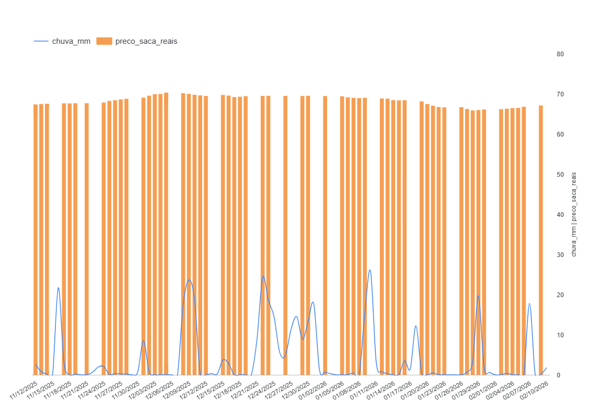

# Monitoramento de Precos de Milho e Variaveis Climaticas - Passo Fundo/RS

Este projeto automatiza a coleta, processamento e visualizacao de dados de precos de milho (CEPEA) correlacionados com variaveis meteorologicas da regiao de Passo Fundo. A estrutura utiliza um pipeline de dados em nuvem para sustentar um dashboard de analise economica.

---

## Arquitetura do Sistema

O projeto utiliza uma abordagem de armazenamento em camadas para garantir a resiliencia dos dados:

1. **Coleta (Python):** Scripts executados via GitHub Actions extraem dados diariamente.
2. **Armazenamento (BigQuery):** Data Warehouse centralizando dados historicos (CSV) e dados em tempo real (API).
3. **Processamento (SQL):** Views otimizadas realizam o tratamento de tipos de dados e a unificacao das series temporais.
4. **Visualizacao (Looker Studio):** Dashboard interativo para analise de correlacao e tendencia.

[Image of a data pipeline diagram from API to Cloud Storage to Dashboard]

---

## Fontes de Dados

* **Precos do Milho:** Indicador CEPEA/ESALQ via biblioteca AgroBR.
* **Dados Climaticos:** Open-Meteo API (Forecast e Archive) para captura de precipitacao e temperatura maxima.
* **Historico:** Base de dados estatica importada manualmente para garantir a continuidade da serie desde 2025.

---

## Estrutura de Automacao

A automacao e gerenciada via GitHub Actions. O workflow garante que o banco de dados e os backups em CSV sejam atualizados sem intervencao manual.

```yaml
name: Atualizacao Diaria
on:
  schedule:
    - cron: '0 9 * * *'
permissions:
  contents: write
jobs:
  run-etl:
    runs-on: ubuntu-latest
    steps:
      - uses: actions/checkout@v3
      - name: Setup Python
        uses: actions/setup-python@v4
      - name: Execute
        run: |
          pip install pandas pandas-gbq requests agrobr pyarrow
          python examples/teste_inmet.py
```
---

## Tratamento de Dados no BigQuery

Foi implementada uma View SQL para resolver conflitos de tipos de dados e garantir a integridade do JOIN entre as tabelas de clima e mercado.

```yaml
        CREATE OR REPLACE VIEW `monitor-passofundo.clima_dados.visao_analitica_milho` AS
    WITH milho_unificado AS (
        SELECT CAST(data AS DATE) AS data, `a vista` AS preco FROM `milho_historico_estatico`
        UNION DISTINCT
        SELECT CAST(data AS DATE) AS data, preco_saca_reais AS preco FROM `precos_milho_cepea`
    )
    SELECT 
        CAST(c.data AS DATE) as data,
        c.chuva_mm,
        c.temp_max,
        m.preco AS preco_saca_reais
    FROM `historico_diario` c
    LEFT JOIN milho_unificado m ON CAST(c.data AS DATE) = m.data
    ORDER BY data ASC
```
---
## Gráfico no LOOKER

Esse gráfico atualiza automaticamente todo dia depois da automação nas actions ser feita

# Visualizacao do Projeto


---

## Como Instalar e Executar

* Pre-requisitos

* Python 3.9+

* Google Cloud Project com API do BigQuery ativa.

* Service Account com permissao de "Editor de Dados do BigQuery".

* GitHub Repository para configuracao de Actions.


# Configuracao Local

1. **Clonar o repositorio:**
```BASH
    git clone [https://github.com/seu-usuario/seu-repositorio.git](https://github.com/seu-usuario/seu-repositorio.git)
    cd seu-repositorio
```

2. **Instalar Dependencias:**
```Bash
    pip install -r requirements.txt
```

3. **Configurar credenciais:**
Salve o JSON da Service Account como google_credentials.json na raiz do projeto.

# Configuracao do GitHub Actions
Cadastre o segredo no GitHub (Settings > Secrets > Actions):
Nome do Secret	     -    Descricao
GOOGLE_CREDENTIALS	 -   Conteudo completo do arquivo JSON da Service Account.

# Estrutura do Repositorio
1. .github/workflows/: Configuracao da rotina de execucao diaria.

2. examples/teste_inmet.py: Script principal de ETL.

3. requirements.txt: Lista de bibliotecas necessarias.

4. *.csv: Arquivos de backup gerados automaticamente pelo pipeline.