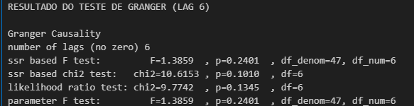
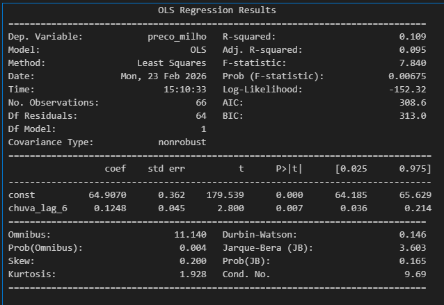
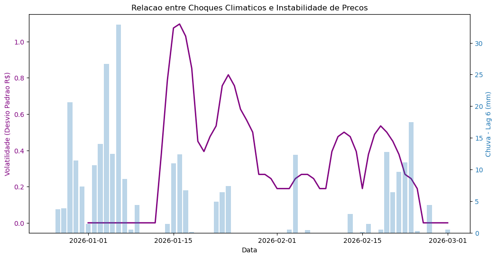

# Monitoramento de Preços de Milho e Variáveis Climáticas - Passo Fundo/RS

Este projeto automatiza a coleta, processamento e visualização de dados de preços de Milho (Praça Passo Fundo/RS - CMA) correlacionados com variáveis meteorológicas da região. A estrutura utiliza um pipeline de dados em nuvem para sustentar uma análise econométrica robusta, quantificando o impacto de choques climáticos no mercado físico regional, usando webscraping, API e Google cloud.

---

## Arquitetura do Sistema

O projeto utiliza uma abordagem de armazenamento em camadas para garantir a resiliência dos dados:

1. **Coleta (Python):** Scripts executados via GitHub Actions extraem dados diariamente às 7 da manhã e mandam pra query.
2. **Armazenamento (BigQuery):** Data Warehouse centralizando dados históricos (sql) e dados em tempo real (API) vindos das _actions_.
3. **Processamento (SQL):** Views otimizadas realizam o tratamento de tipos de dados e a unificação das séries temporais, dentro do próprio BigQuery.
4. **Análise Econométrica (Jupyter):** Modelagem de causalidade, regressão linear (OLS) e análise de volatilidade.
5. **Visualização (Looker Studio):** Dashboard interativo para monitoramento de tendências em tempo real.


---

## Fontes de Dados

* **Precos do Milho:** Web Scraping customizado via BeautifulSoup e Pandas extraindo cotações do mercado físico (CMA) diretamente do Notícias Agrícolas.
* **Dados Climáticos:** Open-Meteo API (Forecast e Archive) para captura de precipitacao e temperatura maxima.
* **Histórico:** Base de dados estática importada manualmente da notícias agrícolas no cloud (BigQuery) para garantir a continuidade da série desde 2025.

---

## Estrutura de Automação
<details>
<summary><b>Automacao (GitHub Actions)</b></summary>
A automação é gerenciada via GitHub Actions. O workflow garante que o banco de dados e os backups em CSV sejam atualizados sem intervenção manual.

```yaml
name: Atualizacao Diaria
on:
  schedule:
    - cron: '0 7 * * *'
permissions:
  contents: write
jobs:
  run-etl:
    runs-on: ubuntu-latest
    steps:
      - uses: actions/checkout@v3
      - name: Setup Python
        uses: actions/setup-python@v4
      - name: Execute
        run: |
          pip install pandas pandas-gbq
          python examples/teste_inmet.py
```
</details>


## Tratamento de Dados no BigQuery
<details>
<summary><b>Tratamento big Q</b></summary>

Foi implementada uma View SQL para resolver conflitos de tipos de dados e garantir a integridade do JOIN entre as tabelas de clima e mercado.

```sql
CREATE OR REPLACE VIEW `monitor-passofundo.clima_dados.visao_completa_clima_milho` AS
SELECT 
    c.data,
    c.precipitacao as chuva_mm,
    c.temp_max,
    m.preco_saca_reais as preco_milho
FROM `monitor-passofundo.clima_dados.historico_diario` AS c
LEFT JOIN `monitor-passofundo.clima_dados.precos_milho_cepea` AS m
    ON CAST(c.data AS DATE) = CAST(m.data AS DATE)
ORDER BY c.data DESC
```
</details>


## Gráfico no LOOKER

Esse gráfico atualiza automaticamente todo dia depois da automação nas >actions< ser feita.


---

# Análise Econômica e Insights

## Metodologia e Inteligência Econométrica

Para superar a lacuna entre dados climáticos (7 dias/semana) e cotações de mercado (5 dias/semana), foi aplicada a técnica de **Forward Fill (ffill)**. Isso permitiu que o modelo computasse chuvas ocorridas em finais de semana, que anteriormente eram descartadas, dobrando a robustez da amostra estatística.

### 1. Identificação de Causalidade (Lag Analysis)
Através do Teste de **Causalidade de Granger**, identificou-se que o impacto máximo da chuva sobre o preço ocorre com uma defasagem de 6 dias (Lag 6). Esse intervalo representa o tempo de resposta logística e o ajuste de oferta nas cooperativas locais.




### 2. Modelo de Regressão Linear (OLS)
Utilizou-se o método de Mínimos Quadrados Ordinários para quantificar o choque financeiro. O modelo apresentou um **p-valor de 0.007**, indicando significância estatística superior a 99%.



$$\Delta Preco \approx 0.125 \times Chuva_{t-6}$$

**Insight:** Para cada 10mm de chuva acumulada em Passo Fundo, o preço da saca tende a subir, em média: **R$ 1,25** apos 6 dias.

### 3. Análise de Volatilidade e Risco
Calculou-se a volatilidade móvel (Desvio Padrão de 7 dias) para medir o estresse do mercado:

$$\sigma = \sqrt{\frac{1}{N-1} \sum_{i=1}^{N} (x_i - \bar{x})^2}$$

Os resultados demonstram que picos de pluviosidade estão correlacionados ao aumento da incerteza de mercado, elevando o risco para produtores e compradores.



---

## Exemplo de Aplicacao: Predição de Curto Prazo

O modelo permite a geracão de alertas e projeções para a abertura de mercado. Abaixo, um exemplo de output gerado pelo sistema utilizando dados reais de 23/02/2026 para prever o impacto logistico na saca de milho no Lag 6 dia 02 de março de 26


*Nota: Esta projeão considera exclusivamente o choque de oferta derivado da pluviosidade regional, isolando variáveis de mercado externo.*

---

## Problemas enfrentados 
A principal barreira técnica deste projeto foi a escassez de APIs gratuitas que fornecessem séries históricas longas para o mercado físico de milho no Brasil (Ticker)

* Limitação da API: A solução encontrada foi fazer webscraping dos dados do site notícias agrícolas

* Estratégia de Mitigação: Para evitar uma análise superficial limitada a um curto período de tempo, foi adotada uma arquitetura híbrida. Realizou-se a extração manual de dados históricos diretamente do notícias agrícolas, que foram tratados e importados como uma base estática no BigQuery.

* Resultado: Através de uma operação de UNION via SQL, foi possível consolidar o histórico legado com a automação presente, garantindo uma série temporal robusta para a aplicação de modelos econométricos.

---

## Como Instalar e Executar
<details>
<summary><b>Instalação</b></summary>

* Pré-requisitos

* Python 3.9+

* Google Cloud Project com API do BigQuery ativa.

* Service Account com permissao de "Editor de Dados do BigQuery".

* GitHub Repository para configuracao de Actions.


## Configuracao Local

1. **Clonar o repositório:**
```bash
   git clone [https://github.com/henriquereolonpain-sys/monitor-clima-pf.git](https://github.com/henriquereolonpain-sys/monitor-clima-pf.git)
   cd monitor-clima-pf
```

2. **Instalar Dependências:**
```Bash
    pip install -r requirements.txt
```

3. **Configurar credenciais:**
Salve o JSON da Service Account como google_credentials.json na raiz do projeto.

## Configuração do GitHub Actions
Cadastre o segredo no GitHub (Settings > Secrets > Actions):
Nome do Secret--> GOOGLE_CREDENTIALS    
Descrição -->   Conteúdo completo do arquivo JSON da Service Account.

## Estrutura do Repositório
1. .github/workflows/: Configuração da rotina de execução diária.

2. examples/teste_inmet.py: Script principal de ETL.

3. requirements.txt: Lista de bibliotecas necessárias.

4. *.csv: Arquivos de backup gerados automaticamente pelo pipeline.
</details>

Obrigado por ler até aqui, esse projeto totalizou 45-50 horas, um big abraço! 🐻